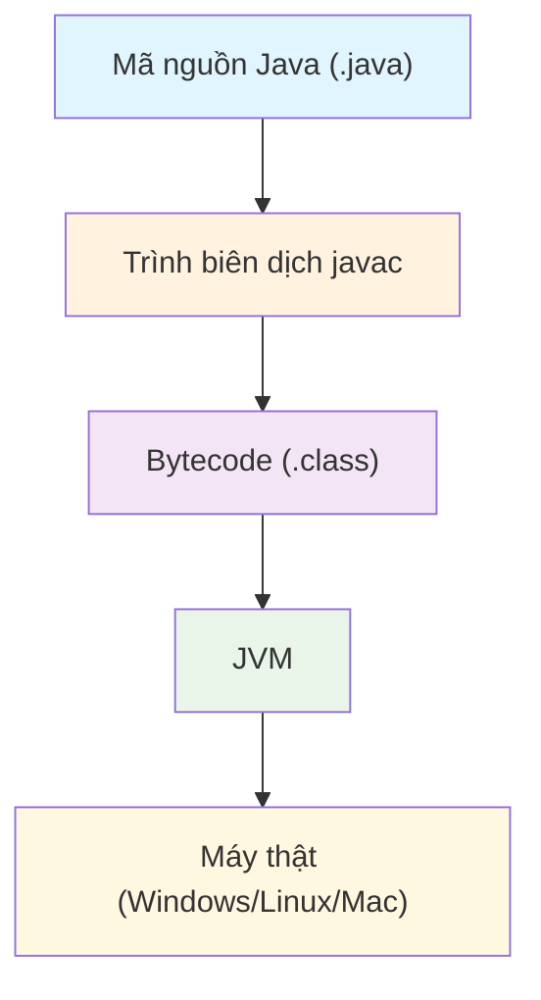

## Giới thiệu

**Java** là một trong những ngôn ngữ lập trình lâu đời và phổ biến nhất trong lĩnh vực phát triển phần mềm.  
Ra đời năm **1995** bởi *James Gosling* tại Sun Microsystems, Java được thiết kế với phương châm **"Write once, run anywhere" (Viết một lần, chạy mọi nơi)**.  
Điều này có nghĩa là chương trình viết bằng Java có thể chạy trên bất kỳ nền tảng nào có cài đặt **Java Virtual Machine (JVM)**.

---

##  Đặc điểm nổi bật của Java

| Đặc điểm               | Mô tả                                                                         |
| ---------------------- | ----------------------------------------------------------------------------- |
| **Đa nền tảng**        | Chạy được trên nhiều hệ điều hành (Windows, macOS, Linux, Android, v.v.)      |
| **Hướng đối tượng**    | Mọi thứ trong Java đều là đối tượng — giúp quản lý và tái sử dụng mã hiệu quả |
| **Bảo mật cao**        | Có lớp kiểm soát truy cập mạnh và cơ chế sandbox để ngăn mã độc               |
| **Thư viện phong phú** | Cung cấp hàng ngàn thư viện hỗ trợ mạng, giao diện, cơ sở dữ liệu, web, v.v.  |
| **Hiệu suất ổn định**  | JVM tối ưu hiệu năng qua JIT Compiler                                         |

---

##  Kiến trúc của Java

Khi bạn chạy một chương trình Java, quá trình diễn ra như sau:

1. **Mã nguồn (.java)** được biên dịch thành **bytecode (.class)**.  
2. **JVM** (Java Virtual Machine) đọc bytecode và thực thi trên máy thật.

📊 **Sơ đồ tổng quát:**


---

## 💡 Ví dụ đầu tiên với Java

Hãy cùng viết chương trình kinh điển “Hello, World!” trong Java:

```java
public class HelloWorld {
    public static void main(String[] args) {
        System.out.println("Xin chào, Java!");
    }
}
```
##  Giải thích cú pháp cơ bản

 `public class HelloWorld`
Khai báo một lớp công khai tên là `HelloWorld`.

`public static void main`
Là phương thức chính — điểm bắt đầu khi chương trình chạy.

`System.out.println(...)`
In ra dòng chữ lên màn hình.

##  Gợi ý hình minh họa
Đặt ảnh vào thư mục `static/images/java-intro-banner.jpg` 
(VD: ảnh Java logo hoặc laptop với code Java)

##  Ứng dụng thực tế của Java

Java được sử dụng ở rất nhiều lĩnh vực:

- **Ứng dụng doanh nghiệp** (Enterprise Java)
- **Ứng dụng Android** (Java là nền tảng cho Android SDK)
- **Ứng dụng web** (Spring Boot, JSP, Servlets)
- **Điện toán đám mây** (AWS, Azure)
- **Hệ thống nhúng, phần mềm máy chủ**

## Kết luận

Java vẫn giữ vị thế quan trọng trong thế giới lập trình nhờ tính ổn định, bảo mật và cộng đồng lớn mạnh. 

Trong các bài viết tiếp theo, chúng ta sẽ cùng nhau đi sâu hơn vào:

- Cấu trúc chương trình Java
- Lập trình hướng đối tượng (OOP)
- Và các kỹ thuật Java trong lập trình mạng 

## Câu hỏi gợi mở

Bạn đã từng viết chương trình đầu tiên bằng Java chưa? Nếu chưa, hãy thử ngay ví dụ "Hello World" phía trên nhé!
