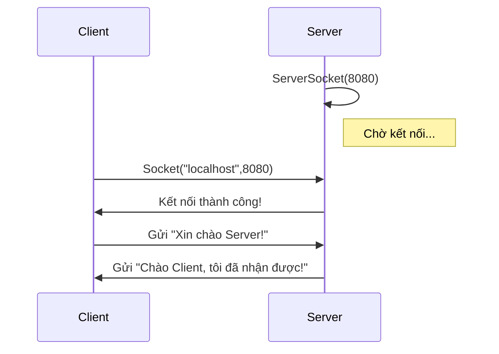

##  Giới thiệu

**Lập trình mạng (Network Programming)** là một phần quan trọng trong Java.  
Nó cho phép các chương trình **giao tiếp qua Internet hoặc mạng LAN**, ví dụ như:
- Chat app
- Web server
- Ứng dụng truyền file
- Hệ thống giao tiếp IoT

Java hỗ trợ mạng rất mạnh thông qua **Socket API** — lớp nằm trong package `java.net`.

---

##  Khái niệm cơ bản về Socket

 **Socket** là điểm cuối (endpoint) của kết nối hai chiều giữa hai tiến trình (process) qua mạng.

Mô hình đơn giản:


| Vai trò                        | Nhiệm vụ                                   |
| ------------------------------ | ------------------------------------------ |
| **ServerSocket**               | Chờ (listen) yêu cầu kết nối từ client     |
| **Socket**                     | Đại diện cho kết nối giữa client và server |
| **InputStream / OutputStream** | Dùng để đọc / ghi dữ liệu                  |

---

## Cách hoạt động

1. **Server** tạo `ServerSocket(port)` → luôn "lắng nghe" tại cổng đó.
2. **Client** tạo `Socket(host, port)` → yêu cầu kết nối.
3. Khi kết nối thành công, **Server** nhận được `Socket` riêng cho client.
4. Hai bên có thể **gửi và nhận dữ liệu** qua luồng I/O.

### Sơ đồ minh họa:



## Ví dụ 1: Server đơn giản

```java
// File: SimpleServer.java
import java.io.*;
import java.net.*;

public class SimpleServer {
    public static void main(String[] args) {
        try (ServerSocket serverSocket = new ServerSocket(8080)) {
            System.out.println("Server đang lắng nghe tại cổng 8080...");
            Socket socket = serverSocket.accept();
            System.out.println("Kết nối từ client: " + socket.getInetAddress());
            
            BufferedReader in = new BufferedReader(
                new InputStreamReader(socket.getInputStream()));
            PrintWriter out = new PrintWriter(socket.getOutputStream(), true);
            
            String message = in.readLine();
            System.out.println("Client gửi: " + message);
            
            out.println("Chào Client! Tôi đã nhận được tin nhắn của bạn.");
            
            socket.close();
        } catch (IOException e) {
            System.err.println("Lỗi server: " + e.getMessage());
        }
    }
}
```

## Ví dụ 2: Client kết nối tới Server

```java
// File: SimpleClient.java
import java.io.*;
import java.net.*;

public class SimpleClient {
    public static void main(String[] args) {
        try (Socket socket = new Socket("localhost", 8080)) {
            System.out.println("Kết nối tới server thành công!");
            
            BufferedReader in = new BufferedReader(
                new InputStreamReader(socket.getInputStream()));
            PrintWriter out = new PrintWriter(socket.getOutputStream(), true);
            
            out.println("Xin chào Server!");
            String response = in.readLine();
            
            System.out.println("Phản hồi từ Server: " + response);
        } catch (IOException e) {
            System.err.println("Lỗi client: " + e.getMessage());
        }
    }
}
```

## Cách chạy thử

1. Mở hai cửa sổ terminal.

2. Trong cửa sổ thứ nhất, chạy Server:
   ```bash
   javac SimpleServer.java
   java SimpleServer
   ```

3. Trong cửa sổ thứ hai, chạy Client:
   ```bash
   javac SimpleClient.java
   java SimpleClient
   ```

4. Quan sát:
   - Server hiển thị tin nhắn nhận từ Client
   - Client nhận phản hồi từ Server

## Kết quả mẫu

### Server console:
```
Server đang lắng nghe tại cổng 8080...
Kết nối từ client: /127.0.0.1
Client gửi: Xin chào Server!
```

### Client console:
```
Kết nối tới server thành công!
Phản hồi từ Server: Chào Client! Tôi đã nhận được tin nhắn của bạn.
```

## Phân tích luồng hoạt động

| Bước | Thực hiện                                               | Mô tả                  |
| ---- | ------------------------------------------------------- | ---------------------- |
| 1    | `new ServerSocket(8080)`                                | Mở cổng và chờ kết nối |
| 2    | `serverSocket.accept()`                                 | Chờ client             |
| 3    | `new Socket("localhost",8080)`                          | Client gửi yêu cầu     |
| 4    | Hai bên trao đổi dữ liệu qua InputStream & OutputStream |                        |

## Một vài lưu ý

- Cổng (port) thường chọn từ 1024 → 65535 (tránh trùng với dịch vụ hệ thống).
- Nếu bạn chạy nhiều lần mà báo lỗi "Address already in use", chờ vài giây hoặc đổi cổng khác (ví dụ 8081).
- Dùng try-with-resources để tự động đóng socket sau khi dùng.
- Trong lập trình mạng thực tế, luôn cần xử lý Timeout, Multi-threading, và Error Logging.

## Bài tập mở rộng

1. Viết chương trình chat 2 chiều giữa client và server.
2. Tạo server cho phép nhiều client kết nối cùng lúc (gợi ý: sử dụng Thread).
3. Ghi log các tin nhắn client gửi vào file `chat.log`.

## Tổng kết

- `ServerSocket` dùng cho phía server để chờ kết nối.
- `Socket` dùng cho client hoặc mỗi kết nối server-client.
- Giao tiếp dựa trên luồng dữ liệu (I/O Stream).
- Đây là nền tảng để phát triển ứng dụng mạng, game online, hoặc API thủ công.

## Bài tiếp theo

"Xây dựng ứng dụng chat nhiều client với đa luồng trong Java" (bạn sẽ học cách mỗi client có một luồng riêng để giao tiếp song song với server!)
