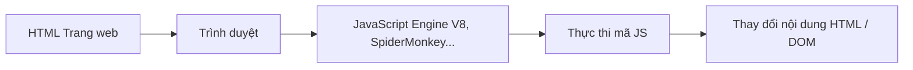

## Bắt đầu nào!

Nếu **HTML** là bộ khung của một trang web, **CSS** là phần trang điểm giúp nó đẹp hơn, thì **JavaScript (JS)** chính là **linh hồn khiến trang web “sống động”** — có thể phản hồi người dùng, xử lý dữ liệu, và thay đổi nội dung mà không cần tải lại trang.

JavaScript là **ngôn ngữ lập trình chạy trên trình duyệt**, giúp tạo ra trải nghiệm tương tác mà bạn vẫn thấy hằng ngày:  
🔹 Nút bấm bật/tắt menu,  
🔹 Form kiểm tra dữ liệu đầu vào,  
🔹 Ảnh chuyển động, hiệu ứng cuộn,  
🔹 Thông báo, trò chuyện, game trên web, v.v.

---

## Phần 1 — JavaScript là gì?

**JavaScript** là ngôn ngữ lập trình **động**, **thông dịch**, và **đa nền tảng**, được thiết kế để chạy trực tiếp trong trình duyệt.

- Viết bằng **file `.js`** hoặc nhúng trực tiếp vào HTML.  
- Được **trình duyệt (browser)** hiểu và thực thi ngay, không cần biên dịch như Java hay C++.  
- Có thể thao tác với nội dung HTML thông qua **DOM (Document Object Model)**.

###  JavaScript khác gì với Java?

| So sánh       | Java                                    | JavaScript                                    |
| ------------- | --------------------------------------- | --------------------------------------------- |
| Loại ngôn ngữ | Biên dịch                               | Thông dịch                                    |
| Chạy ở đâu    | Máy ảo JVM                              | Trình duyệt                                   |
| Mục đích      | Ứng dụng backend, desktop               | Web frontend                                  |
| Cú pháp       | Nghiêm ngặt, hướng đối tượng hoàn chỉnh | Linh hoạt, hướng đối tượng dựa trên prototype |
| File          | `.java`                                 | `.js`                                         |

>  Dù tên giống nhau, **Java và JavaScript hoàn toàn khác nhau** — giống như “car” và “carpet”.

---

## Phần 2 — JavaScript chạy trong trình duyệt như thế nào?

Khi bạn mở một trang web có JavaScript, trình duyệt sẽ:

1. **Đọc mã HTML**  
2. **Phân tích và tải file JS**  
3. **Chạy từng dòng mã JavaScript** theo thứ tự  
4. **Cập nhật giao diện (DOM)** hoặc phản hồi người dùng

Ví dụ, khi bạn bấm nút, JS có thể thay đổi nội dung trang mà không tải lại toàn bộ.


---

## Phần 3 — Biến, kiểu dữ liệu, hàm, toán tử

### 1. Biến (Variables)

Dùng để lưu trữ dữ liệu tạm thời. Khai báo bằng `let`, `const` hoặc `var`.

```javascript
let name = "Truc";
const age = 21;
var city = "Ho Chi Minh";
```

- **let** – dùng khi giá trị có thể thay đổi
- **const** – dùng khi giá trị cố định
- **var** – cú pháp cũ (nên tránh trong code hiện đại)

### 2. Kiểu dữ liệu (Data Types)

| Kiểu             | Ví dụ                     | Mô tả                               |
| ---------------- | ------------------------- | ----------------------------------- |
| Number           | `10`, `3.14`              | Số học                              |
| String           | `"Hello"`                 | Chuỗi ký tự                         |
| Boolean          | `true`, `false`           | Đúng / Sai                          |
| Array            | `[1, 2, 3]`               | Danh sách                           |
| Object           | `{ name: "An", age: 20 }` | Dạng từ khóa–giá trị                |
| Null / Undefined | `null`, `undefined`       | Không có giá trị / chưa gán giá trị |

### 3. Toán tử (Operators)

```javascript
let x = 10;
let y = 5;

console.log(x + y); // 15
console.log(x * y); // 50
console.log(x > y); // true
console.log(x === 10); // true
```

### 4. Hàm (Functions)

Hàm là khối mã có thể tái sử dụng.

```javascript
function greet(name) {
  console.log("Xin chào, " + name + "!");
}

greet("Trúc"); // Kết quả: Xin chào, Trúc!
```

Hoặc dùng arrow function (cú pháp hiện đại hơn):

```javascript
const greet = name => console.log(`Xin chào, ${name}!`);
```

## Phần 4 — Thực hành "Hello World" đầu tiên

### 1. In thông báo bằng alert()

```html
<script>
alert("Hello World!");
</script>
```

Khi tải trang, trình duyệt sẽ hiển thị một hộp thoại nhỏ.

### 2. In ra bảng console bằng console.log()

```html
<script>
console.log("Hello World!");
</script>
```

Kết quả hiển thị trong Console tab của Developer Tools (F12).

### 3. Kết hợp với HTML

```html
<!DOCTYPE html>
<html>
  <body>
    <h2>Xin chào JavaScript!</h2>
    <button onclick="sayHello()">Nhấn tôi!</button>
    
    <script>
      function sayHello() {
        alert("Chào mừng bạn đến với JavaScript!");
      }
    </script>
  </body>
</html>
```

## Phần 5 — Cách chạy JavaScript

### Cách 1: Nhúng trực tiếp trong HTML

```html
<script>
  console.log("Hello từ script trong HTML!");
</script>
```

### Cách 2: Tách file .js riêng

```html
<script src="main.js"></script>
```

Và trong `main.js`:

```javascript
console.log("Hello từ file riêng!");
```

### Cách 3: Chạy trong Console của trình duyệt

Mở DevTools (F12 → Console) và gõ:

```javascript
alert("Xin chào thế giới!");
```

## Kết luận

JavaScript là ngôn ngữ cốt lõi của web hiện đại, cho phép bạn:

- Thêm tính năng tương tác, kiểm tra dữ liệu, hiệu ứng động.
- Là nền tảng để học React, Vue, Angular, hoặc Node.js.
- Là bước đầu tiên để trở thành Front-end Developer.

## Tài liệu tham khảo

- [MDN Web Docs – JavaScript](https://developer.mozilla.org/en-US/docs/Web/JavaScript)
- [W3Schools – JavaScript Tutorial](https://www.w3schools.com/js/)
- [JavaScript.info – Modern JS Guide](https://javascript.info/)
- [ECMAScript Specification](https://tc39.es/ecma262/)

