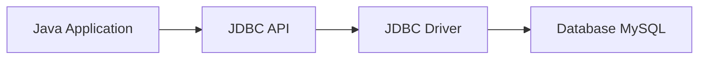

## Bắt đầu nào!

Trong các ứng dụng Java, việc lưu trữ và truy xuất dữ liệu thường được thực hiện thông qua cơ sở dữ liệu. **JDBC (Java Database Connectivity)** là API tiêu chuẩn giúp Java kết nối và giao tiếp với nhiều hệ quản trị cơ sở dữ liệu khác nhau, chẳng hạn như **MySQL**.  
Bài viết này sẽ hướng dẫn bạn từ cơ bản đến thực hành cách **kết nối Java với MySQL** và **thực hiện truy vấn dữ liệu**.

Bạn sẽ học được:
- Cấu trúc và thành phần của JDBC
- Cách kết nối Java với MySQL
- Thực hiện các thao tác cơ bản: `SELECT`, `INSERT`
- Ví dụ lưu thông tin người dùng hoặc lịch sử chat

---

## Phần 1 — Tổng quan về JDBC

**JDBC** là một giao diện lập trình ứng dụng (API) giúp Java có thể:
- Kết nối với cơ sở dữ liệu (MySQL, PostgreSQL, SQL Server, v.v.)
- Gửi và thực thi các lệnh SQL (SELECT, INSERT, UPDATE, DELETE)
- Nhận kết quả trả về từ cơ sở dữ liệu

### Cấu trúc JDBC gồm 4 thành phần chính:

1. **Driver** – Cầu nối giữa Java và hệ quản trị CSDL  
   Ví dụ: MySQL có driver riêng là `mysql-connector-java.jar`.

2. **Connection** – Đại diện cho một kết nối tới cơ sở dữ liệu.

3. **Statement / PreparedStatement** – Dùng để gửi các câu lệnh SQL.

4. **ResultSet** – Chứa kết quả trả về khi thực hiện câu lệnh `SELECT`.

Sơ đồ hoạt động:



---

## Phần 2 — Chuẩn bị môi trường

### 1. Cài đặt MySQL

- Tải và cài đặt MySQL Server + MySQL Workbench.
- Tạo cơ sở dữ liệu ví dụ:

```sql
CREATE DATABASE chat_app;
USE chat_app;

CREATE TABLE users (
  id INT AUTO_INCREMENT PRIMARY KEY,
  username VARCHAR(50),
  message TEXT
);
```

### 2. Cài đặt MySQL Connector

Nếu dùng Maven, thêm dependency vào `pom.xml`:

```xml
<dependency>
    <groupId>mysql</groupId>
    <artifactId>mysql-connector-java</artifactId>
    <version>8.1.0</version>
</dependency>
```

Nếu chạy bằng tay, tải file `.jar` tại https://dev.mysql.com/downloads/connector/j/ và thêm vào classpath của project.

## Phần 3 — Kết nối MySQL bằng JDBC

Dưới đây là ví dụ Java cơ bản để kiểm tra kết nối thành công.

```java
import java.sql.Connection;
import java.sql.DriverManager;
import java.sql.SQLException;

public class ConnectMySQL {
    public static void main(String[] args) {
        String url = "jdbc:mysql://localhost:3306/chat_app";
        String user = "root";
        String password = "123456";
        
        try {
            Connection conn = DriverManager.getConnection(url, user, password);
            System.out.println("Kết nối thành công đến MySQL!");
            conn.close();
        } catch (SQLException e) {
            e.printStackTrace();
        }
    }
}
```

### Giải thích:

- `DriverManager.getConnection(...)`: tạo đối tượng Connection.
- `jdbc:mysql://localhost:3306/chat_app`: định nghĩa đường dẫn JDBC đến CSDL MySQL.
- Đừng quên `conn.close()` để đóng kết nối.

## Phần 4 — Thực hiện truy vấn SQL cơ bản

### 1. Thêm dữ liệu (INSERT)

```java
import java.sql.*;

public class InsertUser {
    public static void main(String[] args) {
        String url = "jdbc:mysql://localhost:3306/chat_app";
        String user = "root";
        String password = "123456";
        
        String sql = "INSERT INTO users (username, message) VALUES (?, ?)";
        
        try (Connection conn = DriverManager.getConnection(url, user, password);
             PreparedStatement stmt = conn.prepareStatement(sql)) {
            
            stmt.setString(1, "Nguyen");
            stmt.setString(2, "Xin chào mọi người!");
            int rows = stmt.executeUpdate();
            
            if (rows > 0) {
                System.out.println("Thêm dữ liệu thành công!");
            }
            
        } catch (SQLException e) {
            e.printStackTrace();
        }
    }
}
```

### 2. Truy xuất dữ liệu (SELECT)

```java
import java.sql.*;

public class SelectUser {
    public static void main(String[] args) {
        String url = "jdbc:mysql://localhost:3306/chat_app";
        String user = "root";
        String password = "123456";
        
        String sql = "SELECT id, username, message FROM users";
        
        try (Connection conn = DriverManager.getConnection(url, user, password);
             PreparedStatement stmt = conn.prepareStatement(sql);
             ResultSet rs = stmt.executeQuery()) {
            
            while (rs.next()) {
                int id = rs.getInt("id");
                String username = rs.getString("username");
                String message = rs.getString("message");
                
                System.out.println(id + " | " + username + " | " + message);
            }
            
        } catch (SQLException e) {
            e.printStackTrace();
        }
    }
}
```

## Phần 5 — Lưu ý khi làm việc với JDBC

- Luôn đóng Connection, Statement, và ResultSet sau khi sử dụng.
- Dùng try-with-resources để đảm bảo tài nguyên được giải phóng tự động.
- Ưu tiên dùng PreparedStatement thay cho Statement để tránh SQL Injection.
- Kiểm tra driver MySQL tương thích với phiên bản JDK.
- Có thể sử dụng Connection Pooling (như HikariCP) để tối ưu hiệu suất cho ứng dụng lớn.

## Phần 6 — Ví dụ thực tế: Lưu lịch sử chat

```java
import java.sql.*;
import java.util.Scanner;

public class ChatLogger {
    public static void main(String[] args) {
        String url = "jdbc:mysql://localhost:3306/chat_app";
        String user = "root";
        String password = "123456";
        Scanner sc = new Scanner(System.in);
        
        System.out.print("Nhập tên người dùng: ");
        String username = sc.nextLine();
        System.out.print("Nhập tin nhắn: ");
        String message = sc.nextLine();
        
        String insertSql = "INSERT INTO users (username, message) VALUES (?, ?)";
        
        try (Connection conn = DriverManager.getConnection(url, user, password);
             PreparedStatement stmt = conn.prepareStatement(insertSql)) {
            
            stmt.setString(1, username);
            stmt.setString(2, message);
            stmt.executeUpdate();
            System.out.println("Tin nhắn đã được lưu thành công!");
            
        } catch (SQLException e) {
            e.printStackTrace();
        }
    }
}
```

## Phần 7 — Cách chạy

### Cách 1: Chạy trong IDE (NetBeans, IntelliJ, Eclipse)

1. Mở IDE
2. Tạo Project Java
3. Thêm `mysql-connector-java.jar` vào Libraries
4. Biên dịch và chạy file `.java`

### Cách 2: Chạy bằng dòng lệnh

```bash
javac ConnectMySQL.java
java -cp .;mysql-connector-java-8.1.0.jar ConnectMySQL
```

## Kết luận

Thông qua JDBC, Java có thể dễ dàng kết nối với MySQL và thực hiện các thao tác với dữ liệu như thêm, đọc, sửa, xóa. Việc hiểu rõ cách hoạt động của JDBC là nền tảng quan trọng để học các công nghệ nâng cao hơn như Hibernate hoặc JPA.

## Tài liệu tham khảo

- [Tài liệu JDBC chính thức của Oracle](https://docs.oracle.com/javase/tutorial/jdbc/)
- [MySQL Connector/J Guide](https://dev.mysql.com/doc/connector-j/8.0/en/)
- [W3Schools JDBC Tutorial](https://www.w3schools.com/java/java_mysql.asp)
- [Baeldung – JDBC Basics](https://www.baeldung.com/java-jdbc)